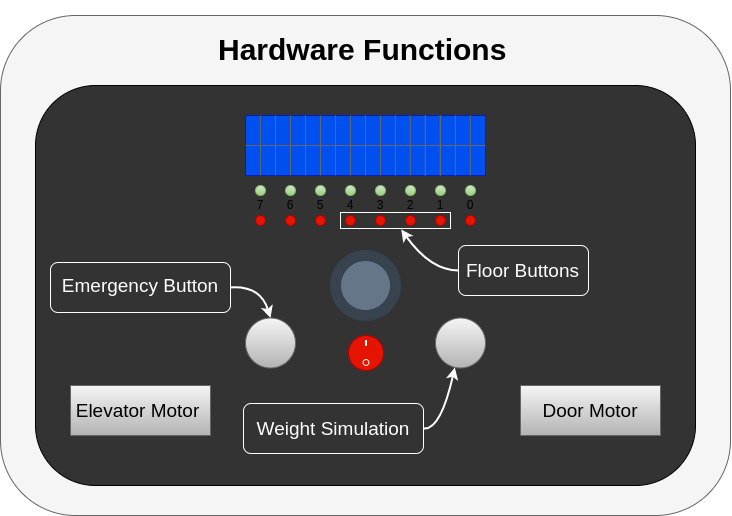

 Vertical express 1.4.0 (latest release)
 -
This is a arduino code that together with the "All in one servo lab" (AISL) hardware,  simulates an elevator that moves between 4 floors. First you need to download and extract elevatorController folder to your computer.
To start the simulation open the elevatorController.ino and upload the code to a AISL unit. Make sure that all the .cpp and .h files from the folder appears as tabs in the Arduino IDE. 
Then open serial monitor. Set correct baudrate(9600) and choose the no line ending option.

`
At each floor unless 1. and 4. there are an up and down button. Theese are represented by keyboard keys [u] and [d], and are controlled via serial monitor.  

1. [u]
2. [u] [d]
3. [u] [d]
4. [d]

To request the elevator. Select current floor you are in by entering 1-4 in serial monitor and press [RETURN]
Then enter desired direction[u/d]. 

The elevator will shortly arrive at selected floor and doors will open.

To simulate weight you can adjust the rigth knob on the lab unit. If the weight is above the set limit an alarm will flash on the LCD screen.

To select the floor you want to go to the buttons 1-4 may be pressed. The LED ligth above the selected button will light up.

The LEDs will also show the requested queue in the direction the elevator is moving.

The cab will stop in all requested floors until it reaches the top or the bottom and then switch direction.

Settings:
-

    Numbers of floor			floors			stateMachine.h
    Distance beetween floors		endcoderPos		stateMachine.h
    Time door is open			doorTime		stateMachine.h
    PID tuning				Kp, Ki, Kd		stateMachine.h
    Set weigt limit  			setWeigth		overload.h
